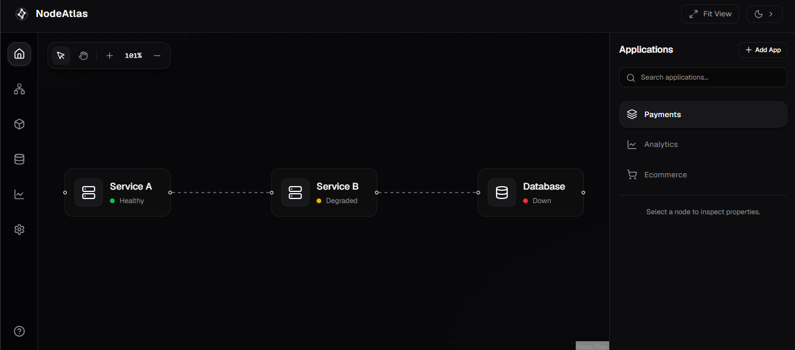
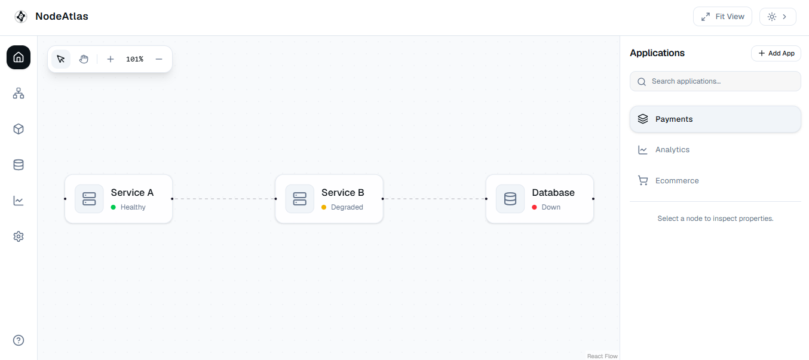

# NodeAtlas

A modern, highly interactive web application designed to visualize, inspect, and configure microservice architectures and topologies. The project leverages **React Flow (XYFlow)** for dynamic canvas orchestration, **Zustand** for transient UI states, and **TanStack Query** for asynchronous mock API data synchronization. It features a developer-centric aesthetic with seamless dark/light modes and fluid micro-animations.

---

## 🚀 Live Demo & Screenshots

> [!NOTE]
> *Deploy your project to a hosting provider (such as Vercel, Netlify, or AWS) and insert your live link and screenshots below.*

- **Live Demo:** [View Live Site](https://nodeatlas.vercel.app)

### Application Mockups

| Dark Mode (Default) | Light Mode |
| :---: | :---: |
|  |  |

---

## 🛠️ Tech Stack

- **Core Framework:** [React 19](https://react.dev/) + [Vite 8](https://vite.dev/) (with Hot Module Replacement)
- **Programming Language:** [TypeScript 6](https://www.typescriptlang.org/)
- **Visual Graph Orchestration:** [@xyflow/react v12 (React Flow)](https://reactflow.dev/)
- **Global State Management:** [Zustand v5](https://zustand.docs.pmnd.rs/getting-started/introduction)
- **Data Fetching & Cache Synchronization:** [TanStack React Query v5](https://tanstack.com/query/latest)
- **Styling System:** [Tailwind CSS v4](https://tailwindcss.com/)
- **UI & Component Primitives:** [shadcn/ui](https://ui.shadcn.com/) (powered by Radix UI and `@base-ui/react`)
- **Iconography:** [Lucide React](https://lucide.dev/)

---

## 📂 Folder Structure

The project follows a clean, modular structure, separating application concerns (data layers, component logic, styling primitives) into clear subdirectories:

```text
project/
├── public/                 # Static public assets
├── src/
│   ├── api/                # Simulated API controllers (Fetching mock responses)
│   │   ├── app.ts          # Fetches all workspace applications
│   │   └── graph.ts        # Fetches topologies per application ID
│   ├── assets/             # Brand logos, variables, and font assets
│   ├── components/         # React components grouped by functional modules
│   │   ├── apps/           # Applications selector list & filters
│   │   ├── canvas/         # React Flow grid orchestration and overlays
│   │   │   └── nodes/      # Custom node definitions, skeleton loads, and errors
│   │   ├── inspector/      # Contextual sidebar inspector (Tabs for Config & Runtime)
│   │   ├── layout/         # TopBar header, Left Rail navigation, Right Panel wrapper
│   │   └── ui/             # Raw primitive design system elements (shadcn config)
│   ├── constants/          # Application-wide read-only data maps
│   ├── hooks/              # Custom React Query endpoints for hooks extraction
│   ├── lib/                # Shared utilities (Tailwind merges, custom class helpers)
│   ├── mocks/              # static JSON structures matching architectural topology
│   ├── store/              # Global Zustand state slice (UI and transient components)
│   ├── types/              # Type declarations and schema specifications
│   ├── App.tsx             # Global application shell, layout, and theme compiler
│   ├── index.css           # Global stylesheet containing tailwind and oklch theme values
│   └── main.tsx            # Application boostrapper and Provider attachments
├── components.json         # Component schemas for shadcn/ui
├── eslint.config.js        # Code quality validation settings
├── index.html              # HTML shell template
├── package.json            # Project manifest, script, and dependencies
├── tsconfig.json           # Base TypeScript configuration
└── vite.config.ts          # Vite builder configuration
```

---

## ⚙️ Setup Instructions

Ensure you have [Node.js](https://nodejs.org/) installed (v18 or higher is recommended).

### 1. Clone & Install Dependencies
Clone the repository, navigate into the project root directory, and install npm modules:
```bash
git clone https://github.com/parthergk/app-graph-builder.git
cd app-graph-builder
npm install
```

### 2. Launch Development Server
Boot up the local Vite server with HMR:
```bash
npm run dev
```
Open your browser and navigate to `http://localhost:5173` (or the port specified in your console).

---

## 📜 Available Scripts

In the project directory, you can run the following package scripts:

| Script | Command | Description |
| :--- | :--- | :--- |
| `npm run dev` | `vite` | Starts the local dev server with full HMR support. |
| `npm run build` | `tsc -b && vite build` | Compiles TypeScript and packages a optimized production bundle into `/dist`. |
| `npm run lint` | `eslint .` | Runs ESLint analysis rules against source files for static verification. |
| `npm run preview` | `vite preview` | Locally spins up a static server previewing the output build code. |

---

## 🧠 Core Architectural Architecture & Technical Decisions

### 1. State Management Approach (Zustand)
We split states between global store transient variables, cache queries, and local React component hooks:
- **Zustand Store (`useBuilderStore`)**: Selected to handle low-frequency global UI layout states where custom prop-drilling or Context API re-renders would impair application responsiveness.
  - Controls selected elements: `selectedAppId` and `selectedNodeId`.
  - Coordinates active canvas interaction states: `activeTool` (hand/pointer mode).
  - Keeps a copy of `graphNodes` in reactive memory. This allows input mutations inside [ConfigurationTab](file:///e:/Internship/ainxy\project/src/components/inspector/ConfigurationTab.tsx) to instantly update nodes inside React Flow's state without round-trips to a database.
- **Local React State**: Employed inside localized UI panels (e.g., search text inputs, tab toggle states, zoom values) to prevent wasteful parent re-renders.

### 2. Data Fetching Strategy (TanStack Query)
Asynchronous application structures (like fetching available services or topological nodes) are routed through custom hooks `useApps` and `useGraph` wrapping **React Query**.
- **Performance benefits**: Implements caching, query invalidation, and automatic loading indicators.
- **Simulated Latency**: Mock API requests implement a realistic `300ms` delay to show skeleton states (`NodeGraphSkeleton` and `AppSkeletonList`), mimicking actual database fetching states.

### 3. React Flow (XYFlow) Implementation Details
The visual graph uses the newly rebranded `@xyflow/react` v12 library:
- **Custom Nodes**: Uses a single custom node registry model, `<ServiceNode />`. It determines status state styling dynamically (healthy, degraded, down) and maps Lucide icons depending on the server type (e.g., matching database labels with `<Database />`).
- **Interactive Tools**: 
  - *Select Tool*: Allows standard click-to-select, node selection, drag placement.
  - *Pan Tool*: Disables node selection/dragging and transforms the canvas into grab-and-pan navigation mode.
- **Edge Animations**: Connection wires feature active SVG animations (`animate-edge-flow`) styling that represents data packages moving through paths dynamically.

### 4. Theme Support (Dark & Light Mode)
The application defaults to Dark Mode and supports a seamless light-mode toggle.
- Synchronized by dynamically adding/removing the `.dark` class on the `document.documentElement` and persistence in `localStorage`.
- Employs **Tailwind v4 OKLCH** variables, enabling high-contrast harmonious colors that adapt automatically.

### 5. Responsive Design
Built with a mobile-first philosophy using flexbox and grid layouts:
- Under **1024px (lg breakpoint)**, the Right Panel (applications listing & node property editor) collapses into an overlay drawer.
- The overlay drawer is toggled via a hamburger menu button inside the `TopBar`.
- The Left Rail navigation layout smoothly switches from vertical sidebar (on desktops) to a sticky bottom rail (on smaller touch viewports) for ergonomic usage.

---

## ⚠️ Known Limitations

1. **Local Mutation Persistence**: Node configurations (changing names, editing descriptions, adjusting capacity sliders) only persist inside the transient Zustand store state in local RAM. Refreshing the browser or changing the selected application resets node data back to the initial mock data.
2. **Read-Only Topology Connection**: The current release does not support adding/deleting connections (edges) directly on the screen or dropping new service nodes onto the React Flow canvas.

---


## 📦 Deployment Instructions

The project is compiled into a highly-efficient static bundle that can be hosted on any Static Web Hosting service:

1. Generate the optimized distribution files:
   ```bash
   npm run build
   ```
2. The compilation artifacts will be output in the `/dist` directory.
3. Deploy the contents of the `/dist` folder to static hosts:
   - **Vercel**: Run `vercel` in the root directory and select default settings.
   - **Netlify**: Drag-and-drop the `/dist` folder to the Netlify dashboard.
   - **GitHub Pages**: Configure GitHub Actions to automatically publish the `/dist` output from the `main` branch.
